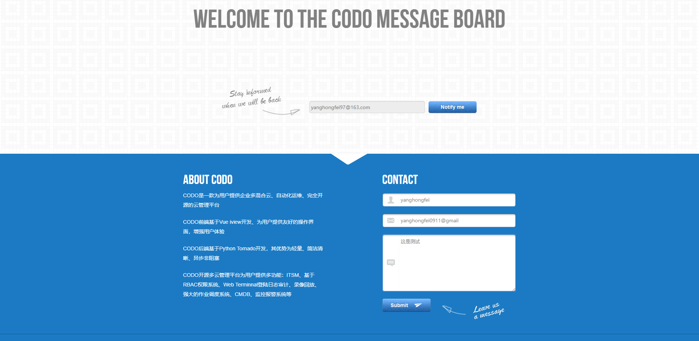

### MessagesBoard

#### 部署文档

**创建数据库**
```
create database `messages_board` default character set utf8mb4 collate utf8mb4_unicode_ci;
```
**修改配置**
- 修改`settings.py`配置信息

**初始化数据**
```
python3 database.py
```

**启动**
```
python3 startup.py --port=8888
```

#### 访问
```
http://172.16.0.101:8888/messages_board
```

#### 项目目录
```
├── biz           //handler
├── database.py   //初始化数据
├── libs          //定制tornado app包等
├── models        //ORM
├── README.md     //README
├── requirements.txt //依赖
├── settings.py      //配置文件信息
├── startup.py       //启动脚本
├── static           //tornado静态文件路径
└── templates        //tornado模板文件路径
```

#### 数据类型
- 很简单，后续这个title改成name
```
MySQL [messages_board]> desc messages_board;
+-----------+--------------+------+-----+-------------------+-----------------------------+
| Field     | Type         | Null | Key | Default           | Extra                       |
+-----------+--------------+------+-----+-------------------+-----------------------------+
| id        | int(11)      | NO   | PRI | NULL              | auto_increment              |
| title     | varchar(100) | NO   |     | NULL              |                             |
| email     | varchar(100) | NO   |     | NULL              |                             |
| message   | longtext     | YES  |     | NULL              |                             |
| create_at | datetime     | NO   |     | NULL              |                             |
| update_at | timestamp    | NO   |     | CURRENT_TIMESTAMP | on update CURRENT_TIMESTAMP |
+-----------+--------------+------+-----+-------------------+-----------------------------+
6 rows in set (0.00 sec)
```

#### 最终效果



#### 其他

- 第一次带前端模板写， 还有前端和后端的判断Email是否符合格式没写，后续加上
